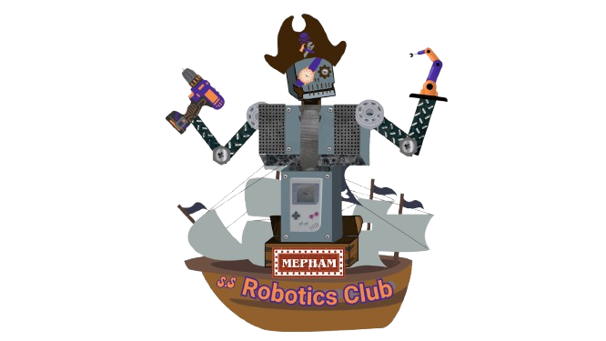

# Mepham Robotics Club Website



## Build. Code. Compete.

Welcome to the official repository for the **Mepham Robotics Club** (Team 77628) website. We are a student-led robotics organization from Wellington C. Mepham High School, competing in the VEX V5 Robotics Competition.

## Mission

Our mission is to foster an inclusive environment where students can thrive in STEM. We focus on:
- **Excellence**: In mechanical design and autonomous programming.
- **Collaboration**: Working together to find the best engineering solutions.
- **Innovation**: Encouraging creative thinking to solve complex challenges.

## Tech Stack

- **HTML5 & CSS3**: Clean, semantic structure with custom CSS for a premium aesthetic.
- **JavaScript**: Interactive features including navigation, search, and countdown timers.
- **Google Fonts**: [Balsamiq Sans](https://fonts.google.com/specimen/Balsamiq+Sans) and [Space Mono](https://fonts.google.com/specimen/Space+Mono).
- **VEX V5**: Our robots are programmed in C++ and Python.

## Project Structure

```text
├── assets/             # Images, icons, and static photos
├── css/                # Main styling (styles.css)
├── js/                 # Main logic (script.js)
├── index.html          # Homepage
├── app.py              # Main Flask application and server logic
├── templates/          # Jinja2 templates for dynamic rendering
│   ├── team.html       # Unified dynamic team profile template
│   ├── admin.html      # Command Center (Admin Dashboard)
│   └── ...             # Other site pages
├── static/             # Static assets (css, js, uploads)
└── ...
```

## Upcoming Events

Check the `index.html` file or the website's timeline section for information on upcoming competitions at:
- Sanford H. Calhoun HS
- Wellington C. Mepham HS
- John F. Kennedy HS

## Support Us

We are always looking for sponsors and donations to help us acquire new parts and compete at the highest level. Visit `donate.html` for more information.
